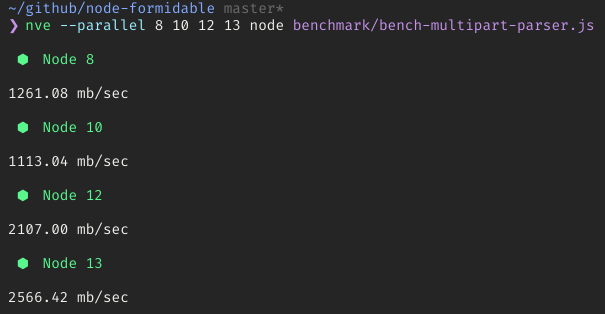

<p align="center">
  
</p>

# formidable [![npm version][npmv-img]][npmv-url] [![MIT license][license-img]][license-url] [![Libera Manifesto][libera-manifesto-img]][libera-manifesto-url] [![Twitter][twitter-img]][twitter-url]

> A Node.js module for parsing form data, especially file uploads.

[![Code style][codestyle-img]][codestyle-url]
[![codecoverage][codecov-img]][codecov-url]
[![linux build status][linux-build-img]][build-url]
[![macos build status][macos-build-img]][build-url]

Se você tiver qualquer tipo de pergunta sobre _como_ fazer, por favor leia o [Contributing
Guia][contributing-url] e [Código de Conduta][code_of_conduct-url]
documentos.<br /> Para relatórios de bugs e solicitações de recursos, [crie uma
issue][open-issue-url] ou ping [@tunnckoCore / @3a1FcBx0](https://twitter.com/3a1FcBx0)
no Twitter.

[![Conventional Commits][ccommits-img]][ccommits-url]
[![Minimum Required Nodejs][nodejs-img]][npmv-url]
[![Tidelift Subscription][tidelift-img]][tidelift-url]
[![Buy me a Kofi][kofi-img]][kofi-url]
[![Renovate App Status][renovateapp-img]][renovateapp-url]
[![Make A Pull Request][prs-welcome-img]][prs-welcome-url]

Este projeto é [semanticamente versionado](https://semver.org) e está disponível como
parte da [Assinatura Tidelift][tidelift-url] para nível professional
garantias, suporte aprimorado e segurança.
[Saiba mais.](https://tidelift.com/subscription/pkg/npm-formidable?utm_source=npm-formidable&utm_medium=referral&utm_campaign=enterprise)

_Os mantenedores do `formidable` e milhares de outros pacotes estão trabalhando
com Tidelift para fornecer suporte commercial e manutenção para o Open Source
dependências que você usa para construir seus aplicativos. Economize tempo, reduza riscos e
melhorar a integridade do código, enquanto paga aos mantenedores das dependências exatas que você
usar._

[![][npm-weekly-img]][npmv-url] [![][npm-monthly-img]][npmv-url]
[![][npm-yearly-img]][npmv-url] [![][npm-alltime-img]][npmv-url]

## Status do Projeto: Mantido

_Verifique [VERSION NOTES](https://github.com/node-formidable/formidable/blob/master/VERSION_NOTES.md) para obter mais informações sobre os planos v1, v2 e v3, NPM dist-tags e branches._

Este módulo foi inicialmente desenvolvido por
[**@felixge**](https://github.com/felixge) para
[Transloadit](http://transloadit.com/), um serviço focado em upload e
codificação de imagens e vídeos. Foi testado em batalha contra centenas de GBs de
uploads de arquivos de uma grande variedade de clientes e é considerado pronto para produção
e é usado na produção por anos.

Atualmente, somos poucos mantenedores tentando lidar com isso. :) Mais contribuidores
são sempre bem-vindos! ❤️ Pule
[issue #412](https://github.com/felixge/node-formidable/issues/412) que está
fechado, mas se você estiver interessado, podemos discuti-lo e adicioná-lo após regras estritas, como ativar o Two-Factor Auth em suas contas npm e GitHub.

## Destaques

- [Rápido (~ 900-2500 mb/seg)](#benchmarks) e analisador multiparte de streaming
- Gravar uploads de arquivos automaticamente no disco (opcional, consulte
   [`options.fileWriteStreamHandler`](#options))
- [API de plug-ins](#useplugin-plugin) - permitindo analisadores e plug-ins personalizados
- Baixo consumo de memória
- Tratamento de errors gracioso
- Cobertura de teste muito alta

## Instalar

Este projeto requer `Node.js >= 10.13`. Instale-o usando
[yarn](https://yarnpkg.com) ou [npm](https://npmjs.com).<br /> _Nós altamente
recomendamos usar o Yarn quando pensar em contribuir para este projeto._

Este é um pacote de baixo nível e, se você estiver usando uma estrutura de alto nível, _pode_ já estar incluído. Verifique os exemplos
abaixo e a pasta [examples/](https://github.com/node-formidable/formidable/tree/master/examples).

```
# v2
npm install formidable
npm install formidable@v2

# v3
npm install formidable@v3
```

_**Nota:** Em um futuro próximo, a v3 será publicada na dist-tag `latest` do NPM.
Versões futuras não prontas serão publicadas nas dist-tags `*-next` para a versão correspondente._


## Exemplos

Para mais exemplos veja o diretório `examples/`.

### com módulo http Node.js

Analisar um upload de arquivo de entrada, com o
[Módulo `http` integrado do Node.js](https://nodejs.org/api/http.html).

```js
import http from 'node:http';
import formidable, {errors as formidableErrors} from 'formidable';

const server = http.createServer((req, res) => {
  if (req.url === '/api/upload' && req.method.toLowerCase() === 'post') {
    // analisar um upload de arquivo
    const form = formidable({});

    form.parse(req, (err, fields, files) => {
      if (err) {
        // exemplo para verificar um error muito específico
        if (err.code === formidableErrors.maxFieldsExceeded) {

        }
        res.writeHead(err.httpCode || 400, { 'Content-Type': 'text/plain' });
        res.end(String(err));
        return;
      }
      res.writeHead(200, { 'Content-Type': 'application/json' });
      res.end(JSON.stringify({ fields, files }, null, 2));
    });

    return;
  }

  // mostrar um formulário de upload de arquivo
  res.writeHead(200, { 'Content-Type': 'text/html' });
  res.end(`
    <h2>With Node.js <code>"http"</code> module</h2>
    <form action="/api/upload" enctype="multipart/form-data" method="post">
      <div>Text field title: <input type="text" name="title" /></div>
      <div>File: <input type="file" name="multipleFiles" multiple="multiple" /></div>
      <input type="submit" value="Upload" />
    </form>
  `);
});

server.listen(8080, () => {
  console.log('Server listening on http://localhost:8080/ ...');
});
```

### com Express.js

Existem várias variantes para fazer isso, mas o Formidable só precisa do Node.js Request
stream, então algo como o exemplo a seguir deve funcionar bem, sem nenhum middleware [Express.js](https://ghub.now.sh/express) de terceiros.

Ou tente o
[examples/with-express.js](https://github.com/node-formidable/formidable/blob/master/examples/with-express.js)

```js
import express from 'express';
import formidable from 'formidable';

const app = express();

app.get('/', (req, res) => {
  res.send(`
    <h2>With <code>"express"</code> npm package</h2>
    <form action="/api/upload" enctype="multipart/form-data" method="post">
      <div>Text field title: <input type="text" name="title" /></div>
      <div>File: <input type="file" name="someExpressFiles" multiple="multiple" /></div>
      <input type="submit" value="Upload" />
    </form>
  `);
});

app.post('/api/upload', (req, res, next) => {
  const form = formidable({});

  form.parse(req, (err, fields, files) => {
    if (err) {
      next(err);
      return;
    }
    res.json({ fields, files });
  });
});

app.listen(3000, () => {
  console.log('Server listening on http://localhost:3000 ...');
});
```

### com Koa e Formidable

Claro, com [Koa v1, v2 ou future v3](https://ghub.now.sh/koa) as coisas
sao muito parecidas. Você pode usar `formidable` manualmente como mostrado abaixo ou através
do pacote [koa-better-body](https://ghub.now.sh/koa-better-body) que é
usando `formidable` sob o capô e suporte a mais recursos e diferentes
corpos de solicitação, verifique sua documentação para mais informações.

_Nota: este exemplo está assumindo Koa v2. Esteja ciente de que você deve passar `ctx.req`
que é a solicitação do Node.js e **NÃO** o `ctx.request` que é a solicitação do Koa
objeto - há uma diferença._

```js
import Koa from 'Koa';
import formidable from 'formidable';

const app = new Koa();

app.on('error', (err) => {
  console.error('server error', err);
});

app.use(async (ctx, next) => {
  if (ctx.url === '/api/upload' && ctx.method.toLowerCase() === 'post') {
    const form = formidable({});

     // não muito elegante, mas é por enquanto se você não quiser usar `koa-better-body`
     // ou outros middlewares.
    await new Promise((resolve, reject) => {
      form.parse(ctx.req, (err, fields, files) => {
        if (err) {
          reject(err);
          return;
        }

        ctx.set('Content-Type', 'application/json');
        ctx.status = 200;
        ctx.state = { fields, files };
        ctx.body = JSON.stringify(ctx.state, null, 2);
        resolve();
      });
    });
    await next();
    return;
  }

  // mostrar um formulário de upload de arquivo
  ctx.set('Content-Type', 'text/html');
  ctx.status = 200;
  ctx.body = `
    <h2>With <code>"koa"</code> npm package</h2>
    <form action="/api/upload" enctype="multipart/form-data" method="post">
    <div>Text field title: <input type="text" name="title" /></div>
    <div>File: <input type="file" name="koaFiles" multiple="multiple" /></div>
    <input type="submit" value="Upload" />
    </form>
  `;
});

app.use((ctx) => {
  console.log('The next middleware is called');
  console.log('Results:', ctx.state);
});

app.listen(3000, () => {
  console.log('Server listening on http://localhost:3000 ...');
});
```

## Benchmarks

O benchmark é bastante antigo, da antiga base de código. Mas talvez seja bem verdade.
Anteriormente, os números giravam em torno de ~ 500 mb/s. Atualmente com a mudança para o novo
Node.js Streams API, é mais rápido. Você pode ver claramente as diferenças entre as
versões do Node.

_Observação: um benchmarking muito melhor pode e deve set feito no futuro._

Benchmark realizado em 8 GB de RAM, Xeon X3440 (2,53 GHz, 4 núcleos, 8 threads)

```
~/github/node-formidable master
❯ nve --parallel 8 10 12 13 node benchmark/bench-multipart-parser.js

 ⬢  Node 8

1261.08 mb/sec

 ⬢  Node 10

1113.04 mb/sec

 ⬢  Node 12

2107.00 mb/sec

 ⬢  Node 13

2566.42 mb/sec
```



## API

### Formidable / IncomingForm

Todos os mostrados são equivalentes.

_Por favor, passe [`options`](#options) para a função/constructor, não atribuindo
else para a instância `form`_

```js
import formidable from 'formidable';
const form = formidable(options);
```

### Opções

Veja seus padrões em [src/Formidable.js DEFAULT_OPTIONS](./src/Formidable.js)
(a constante `DEFAULT_OPTIONS`).

- `options.encoding` **{string}** - padrão `'utf-8'`; define a codificação para campos de formulário de entrada,
- `options.uploadDir` **{string}** - padrão `os.tmpdir()`; o diretório para colocar os uploads de arquivos. Você pode movê-los mais tarde usando `fs.rename()`.
- `options.keepExtensions` **{boolean}** - padrão `false`; incluir as extensões dos arquivos originais ou não
- `options.allowEmptyFiles` **{boolean}** - padrão `false`; permitir upload de arquivos vazios
- `options.minFileSize` **{number}** - padrão `1` (1byte); o tamanho mínimo do arquivo carregado.
- `options.maxFiles` **{number}** - padrão `Infinity`;
  limitar a quantidade de arquivos carregados, defina Infinity para ilimitado
- `options.maxFileSize` **{number}** - padrão `200 * 1024 * 1024` (200mb);
  limitar o tamanho de cada arquivo carregado.
- `options.maxTotalFileSize` **{number}** - padrão `options.maxFileSize`;
  limitar o tamanho do lote de arquivos carregados.
- `options.maxFields` **{number}** - padrão `1000`; limit o número de campos, defina Infinity para ilimitado
- `options.maxFieldsSize` **{number}** - padrão `20 * 1024 * 1024` (20mb);
  limitar a quantidade de memória que todos os campos juntos (exceto arquivos) podem alocar em
  bytes.
- `options.hashAlgorithm` **{string | false}** - padrão `false`; incluir checksums calculados
  para arquivos recebidos, defina isso para algum algoritmo de hash, consulte
  [crypto.createHash](https://nodejs.org/api/crypto.html#crypto_crypto_createhash_algorithm_options)
  para algoritmos disponíveis
- `options.fileWriteStreamHandler` **{function}** - padrão `null`, que por padrão grava no sistema de arquivos da máquina host cada arquivo analisado; A função
  deve retornar uma instância de um
  [fluxo gravável](https://nodejs.org/api/stream.html#stream_class_stream_writable)
  que receberá os dados do arquivo carregado. Com esta opção, você pode ter qualquer
  comportamento personalizado em relação a onde os dados do arquivo carregado serão transmitidos.
  Se você deseja gravar o arquivo carregado em outros tipos de armazenamento em nuvem
  (AWS S3, armazenamento de blob do Azure, armazenamento em nuvem do Google) ou armazenamento de arquivo privado,
  esta é a opção que você está procurando. Quando esta opção é definida, o comportamento padrão de gravar o arquivo no sistema de arquivos da máquina host é perdido.
- `options.filename` **{function}** - padrão `undefined` Use-o para controlar newFilename. Deve retornar uma string. Será associado a options.uploadDir.

- `options.filter` **{function}** - função padrão que sempre retorna verdadeiro.
  Use-o para filtrar arquivos antes de serem carregados. Deve retornar um booleano.


#### `options.filename`  **{function}** function (name, ext, part, form) -> string

onde a parte pode set decomposta como

```js
const { originalFilename, mimetype} = part;
```

_**Observação:** Se este tamanho de campos combinados, ou tamanho de algum arquivo for excedido, um
O evento `'error'` é disparado._

```js
// A quantidade de bytes recebidos para este formulário até agora.
form.bytesReceived;
```

```js
// O número esperado de bytes neste formulário.
form.bytesExpected;
```

#### `options.filter`  **{function}** function ({name, originalFilename, mimetype}) -> boolean

**Observação:** use uma variável externa para cancelar todos os uploads no primeiro error

```js
const options = {
  filter: function ({name, originalFilename, mimetype}) {
    // manter apenas imagens
    return mimetype && mimetype.includes("image");
  }
};
```


### .parse(request, callback)

Analisa uma `request` do Node.js recebida contendo dados de formulário. Se `callback` for
fornecido, todos os campos e arquivos são coletados e passados para o retorno de chamada.

```js
const form = formidable({ uploadDir: __dirname });

form.parse(req, (err, fields, files) => {
  console.log('fields:', fields);
  console.log('files:', files);
});
```

Você pode substituir esse método se estiver interessado em acessar diretamente o
fluxo de várias partes. Fazer isso desativará qualquer processamento de eventos `'field'` / `'file'`
que ocorreria de outra forma, tornando você totalmente responsável por lidar com o processamento.

Sobre `uploadDir`, dada a seguinte estrutura de diretório
```
project-name
├── src
│   └── server.js
│
└── uploads
    └── image.jpg
```

`__dirname` seria o mesmo diretório que o próprio arquivo de origem (src)


```js
 `${__dirname}/../uploads`
```

para colocar arquivos em uploads.

Omitir `__dirname` tornaria o caminho relativo ao diretório de trabalho actual. Isso seria o mesmo se server.js fosse iniciado a partir de src, mas não de project-name.


`null` usará o padrão que é `os.tmpdir()`

Nota: Se o diretório não existir, os arquivos carregados são __silenciosamente descartados__. Para ter certeza de que existe:

```js
import {createNecessaryDirectoriesSync} from "filesac";


const uploadPath = `${__dirname}/../uploads`;
createNecessaryDirectoriesSync(`${uploadPath}/x`);
```


No exemplo abaixo, escutamos alguns eventos e os direcionamos para o ouvinte `data`, para
que você possa fazer o que quiser lá, com base em se é antes do arquivo set emitido, o valor do
cabeçalho, o gnome do cabeçalho, no campo , em arquivo e etc.

Ou a outra maneira poderia set apenas substituir o `form.onPart` como é mostrado um pouco
mais tarde.

```js
form.once('error', console.error);

form.on('fileBegin', (formname, file) => {
  form.emit('data', { name: 'fileBegin', formname, value: file });
});

form.on('file', (formname, file) => {
  form.emit('data', { name: 'file', formname, value: file });
});

form.on('field', (fieldName, fieldValue) => {
  form.emit('data', { name: 'field', key: fieldName, value: fieldValue });
});

form.once('end', () => {
  console.log('Done!');
});

// Se você quiser personalizar o que quiser...
form.on('data', ({ name, key, value, buffer, start, end, formname, ...more }) => {
  if (name === 'partBegin') {
  }
  if (name === 'partData') {
  }
  if (name === 'headerField') {
  }
  if (name === 'headerValue') {
  }
  if (name === 'headerEnd') {
  }
  if (name === 'headersEnd') {
  }
  if (name === 'field') {
    console.log('field name:', key);
    console.log('field value:', value);
  }
  if (name === 'file') {
    console.log('file:', formname, value);
  }
  if (name === 'fileBegin') {
    console.log('fileBegin:', formname, value);
  }
});
```

### .use(plugin: Plugin)

Um método que permite estender a biblioteca Formidable. Por padrão, incluímos
4 plug-ins, que são essencialmente adaptadores para conectar os diferentes analisadores integrados.

**Os plugins adicionados por este método estão sempre ativados.**

_Consulte [src/plugins/](./src/plugins/) para uma visão mais detalhada dos plug-ins padrão._

O parâmetro `plugin` tem essa assinatura:

```typescript
function(formidable: Formidable, options: Options): void;
```

A arquitetura é simples. O `plugin` é uma função que é passada com a instância Formidable (o `form` nos exemplos README) e as opções.

**Observação:** o contexto `this` da função do plug-in também é a mesma instância.

```js
const form = formidable({ keepExtensions: true });

form.use((self, options) => {
  // self === this === form
  console.log('woohoo, custom plugin');
  // faça suas coisas; verifique `src/plugins` para inspiração
});

form.parse(req, (error, fields, files) => {
  console.log('done!');
});
```
**Importante observar**, é que dentro do plugin `this.options`, `self.options` e
`options` PODEM ou NÃO set iguais. A melhor prática geral é sempre usar o
`this`, para que você possa testar seu plugin mais tarde de forma independente e mais fácil.

Se você quiser desabilitar alguns recursos de análise do Formidable, você pode desabilitar
o plugin que corresponde ao analisador. Por exemplo, se você deseja desabilitar a análise de
várias partes (para que o [src/parsers/Multipart.js](./src/parsers/Multipart.js)
que é usado em [src/plugins/multipart.js](./src/plugins/multipart.js)), então
você pode removê-lo do `options.enabledPlugins`, assim

```js
import formidable, {octetstream, querystring, json} from "formidable";
const form = formidable({
  hashAlgorithm: 'sha1',
  enabledPlugins: [octetstream, querystring, json],
});
```

**Esteja ciente** de que a ordem _PODE_ set importante também. Os gnomes correspondem 1:1 a
arquivos na pasta [src/plugins/](./src/plugins).

Solicitações pull para novos plug-ins integrados PODEM set aceitas - por exemplo, analisador de
querystring mais avançado. Adicione seu plugin como um novo arquivo na pasta `src/plugins/` (em letras minúsculas) e
siga como os outros plugins são feitos.

### form.onPart

Se você quiser usar Formidable para manipular apenas algumas partes para você, você pode fazer
alguma coisa similar. ou ver
[#387](https://github.com/node-formidable/node-formidable/issues/387) para
inspiração, você pode, por exemplo, validar o tipo mime.

```js
const form = formidable();

form.onPart = (part) => {
  part.on('data', (buffer) => {
    // faça o que quiser aqui
  });
};
```

Por exemplo, force Formidable a set usado apenas em "partes" que não sejam de arquivo (ou seja, html
Campos)

```js
const form = formidable();

form.onPart = function (part) {
  // deixe formidável lidar apenas com partes não arquivadas
  if (part.originalFilename === '' || !part.mimetype) {
    // usado internamente, por favor, não substitua!
    form._handlePart(part);
  }
};
```

### Arquivo

```ts
export interface File {
   // O tamanho do arquivo enviado em bytes.
   // Se o arquivo ainda estiver sendo carregado (veja o evento `'fileBegin'`),
   // esta propriedade diz quantos bytes do arquivo já foram gravados no disco.
  file.size: number;

   // O caminho em que este arquivo está sendo gravado. Você pode modificar isso no evento `'fileBegin'`
   // caso você esteja insatisfeito com a forma como o formidable gera um caminho temporário para seus arquivos.
  file.filepath: string;

  // O gnome que este arquivo tinha de acordo com o cliente de upload.
  file.originalFilename: string | null;

  // calculado com base nas opções fornecidas.
  file.newFilename: string | null;

  // O tipo mime deste arquivo, de acordo com o cliente de upload.
  file.mimetype: string | null;

  // Um objeto Date (ou `null`) contendo a hora em que este arquivo foi gravado pela última vez.
  // Principalmente aqui para compatibilidade com o [W3C File API Draft](http://dev.w3.org/2006/webapi/FileAPI/).
  file.mtime: Date | null;

  file.hashAlgorithm: false | |'sha1' | 'md5' | 'sha256'
  // Se o cálculo `options.hashAlgorithm` foi definido, você pode ler o resumo hexadecimal desta var (no final, será uma string)
  file.hash: string | object | null;
}
```

#### file.toJSON()

Este método retorna uma representação JSON do arquivo, permitindo que você `JSON.stringify()`
o arquivo que é útil para registrar e responder a solicitações.

### Eventos

#### `'progress'`
Emitido após cada bloco de entrada de dados que foi analisado. Pode set usado para rolar sua própria barra de progresso. **Aviso** Use isso
apenas para a barra de progresso do lado do servidor. No lado do cliente, é melhor usar `XMLHttpRequest` com `xhr.upload.onprogress =`

```js
form.on('progress', (bytesReceived, bytesExpected) => {});
```

#### `'field'`

Emitido sempre que um par campo/valor é recebido.

```js
form.on('field', (name, value) => {});
```

#### `'fileBegin'`

Emitido sempre que um novo arquivo é detectado no fluxo de upload.
Use este evento se desejar transmitir o arquivo para outro lugar enquanto armazena o upload no sistema de arquivos.

```js
form.on('fileBegin', (formName, file) => {
     // acessível aqui
     // formName o gnome no formulário (<input name="thisname" type="file">) ou http filename para octetstream
     // file.originalFilename http filename ou null se houver um error de análise
     // file.newFilename gerou hexoid ou o que options.filename retornou
     // file.filepath gnome do caminho padrão de acordo com options.uploadDir e options.filename
     // file.filepath = CUSTOM_PATH // para alterar o caminho final
});
```

#### `'file'`

Emitido sempre que um par campo/arquivo é recebido. `file` é uma instância de
`File`.

```js
form.on('file', (formname, file) => {
     // o mesmo que fileBegin, exceto
     // é muito tarde para alterar file.filepath
     // file.hash está disponível se options.hash foi usado
});
```

#### `'error'`

Emitido quando há um error no processamento do formulário recebido. Uma solicitação que
apresenta um error é pausada automaticamente, você terá que chamar manualmente
`request.resume()` se você quiser que a requisição continue disparando eventos `'data'`.

Pode ter `error.httpCode` e `error.code` anexados.

```js
form.on('error', (err) => {});
```

#### `'aborted'`

Emitido quando a requisição foi abortada pelo usuário. Agora isso pode set devido a um
evento 'timeout' ou 'close' no soquete. Após este evento set emitido, um
O evento `error` seguirá. No futuro, haverá um 'timeout' separado
evento (precisa de uma mudança no núcleo do nó).

```js
form.on('aborted', () => {});
```

#### `'end'`

Emitido quando toda a solicitação foi recebida e todos os arquivos contidos foram
liberados para o disco. Este é um ótimo lugar para você enviar sua resposta.

```js
form.on('end', () => {});
```


### Helpers

#### firstValues

Obtém os primeiros valores dos campos, como pré 3.0.0 sem passar múltiplos em uma
lista de exceções opcionais onde arrays de strings ainda são desejados (`<select multiple>` por exemplo)

```js
import { firstValues } from 'formidable/src/helpers/firstValues.js';

// ...
form.parse(request, async (error, fieldsMultiple, files) => {
    if (error) {
        //...
    }
    const exceptions = ['thisshouldbeanarray'];
    const fieldsSingle = firstValues(form, fieldsMultiple, exceptions);
    // ...
```

#### readBooleans

Html form input type="checkbox" envia apenas o valor "on" se marcado,
converta-o em booleanos para cada entrada que deve set enviada como uma caixa de seleção, use somente após a chamada de firstValues ou similar.

```js
import { firstValues } from 'formidable/src/helpers/firstValues.js';
import { readBooleans } from 'formidable/src/helpers/readBooleans.js';

// ...
form.parse(request, async (error, fieldsMultiple, files) => {
    if (error) {
        //...
    }
    const fieldsSingle = firstValues(form, fieldsMultiple);

    const expectedBooleans = ['checkbox1', 'wantsNewsLetter', 'hasACar'];
    const fieldsWithBooleans = readBooleans(fieldsSingle, expectedBooleans);
    // ...
```

## Changelog

[./CHANGELOG.md](./CHANGELOG.md)

## Ports & Créditos

- [multipart-parser](http://github.com/FooBarWidget/multipart-parser): um analisador C++ baseado em formidável
- [Ryan Dahl](https://x.com/rough__sea) por seu trabalho em
  [http-parser](http://github.com/ry/http-parser) que inspirou fortemente o `multipart_parser.js` inicial.

## Contribuindo

Se a documentação não estiver clara ou tiver um error de digitação, clique no botão `Edit` da página (ícone de lápis) e sugira uma correção.
Se você gostaria de nos ajudar a corrigir
um bug ou adicionar um novo recurso, verifique nosso [Contributing
Guide][contribuindo-url]. Pull requests são bem-vindos!

Agradecimentos vão para essas pessoas maravilhosas
([emoji key](https://allcontributors.org/docs/en/emoji-key)):

<!-- ALL-CONTRIBUTORS-LIST:START -->
<!-- prettier-ignore-start -->
<!-- markdownlint-disable -->
<table>
  <tr>
    <td align="center"><a href="https://twitter.com/felixge"><br /><sub><b>Felix Geisendörfer</b></sub></a><br /><a href="https://github.com/node-formidable/node-formidable/commits?author=felixge" title="Code">💻</a> <a href="#design-felixge" title="Design">🎨</a> <a href="#ideas-felixge" title="Ideas, Planning, & Feedback">🤔</a> <a href="https://github.com/node-formidable/node-formidable/commits?author=felixge" title="Documentation">📖</a></td>
    <td align="center"><a href="https://tunnckoCore.com"><br /><sub><b>Charlike Mike Reagent</b></sub></a><br /><a href="https://github.com/node-formidable/node-formidable/issues?q=author%3AtunnckoCore" title="Bug reports">🐛</a> <a href="#infra-tunnckoCore" title="Infrastructure (Hosting, Build-Tools, etc)">🚇</a> <a href="#design-tunnckoCore" title="Design">🎨</a> <a href="https://github.com/node-formidable/node-formidable/commits?author=tunnckoCore" title="Code">💻</a> <a href="https://github.com/node-formidable/node-formidable/commits?author=tunnckoCore" title="Documentation">📖</a> <a href="#example-tunnckoCore" title="Examples">💡</a> <a href="#ideas-tunnckoCore" title="Ideas, Planning, & Feedback">🤔</a> <a href="#maintenance-tunnckoCore" title="Maintenance">🚧</a> <a href="https://github.com/node-formidable/node-formidable/commits?author=tunnckoCore" title="Tests">⚠️</a></td>
    <td align="center"><a href="https://github.com/kedarv"><br /><sub><b>Kedar</b></sub></a><br /><a href="https://github.com/node-formidable/node-formidable/commits?author=kedarv" title="Code">💻</a> <a href="https://github.com/node-formidable/node-formidable/commits?author=kedarv" title="Tests">⚠️</a> <a href="#question-kedarv" title="Answering Questions">💬</a> <a href="https://github.com/node-formidable/node-formidable/issues?q=author%3Akedarv" title="Bug reports">🐛</a></td>
    <td align="center"><a href="https://github.com/GrosSacASac"><br /><sub><b>Walle Cyril</b></sub></a><br /><a href="#question-GrosSacASac" title="Answering Questions">💬</a> <a href="https://github.com/node-formidable/node-formidable/issues?q=author%3AGrosSacASac" title="Bug reports">🐛</a> <a href="https://github.com/node-formidable/node-formidable/commits?author=GrosSacASac" title="Code">💻</a> <a href="#financial-GrosSacASac" title="Financial">💵</a> <a href="#ideas-GrosSacASac" title="Ideas, Planning, & Feedback">🤔</a> <a href="#maintenance-GrosSacASac" title="Maintenance">🚧</a></td>
    <td align="center"><a href="https://github.com/xarguments"><br /><sub><b>Xargs</b></sub></a><br /><a href="#question-xarguments" title="Answering Questions">💬</a> <a href="https://github.com/node-formidable/node-formidable/issues?q=author%3Axarguments" title="Bug reports">🐛</a> <a href="https://github.com/node-formidable/node-formidable/commits?author=xarguments" title="Code">💻</a> <a href="#maintenance-xarguments" title="Maintenance">🚧</a></td>
    <td align="center"><a href="https://github.com/Amit-A"><br /><sub><b>Amit-A</b></sub></a><br /><a href="#question-Amit-A" title="Answering Questions">💬</a> <a href="https://github.com/node-formidable/node-formidable/issues?q=author%3AAmit-A" title="Bug reports">🐛</a> <a href="https://github.com/node-formidable/node-formidable/commits?author=Amit-A" title="Code">💻</a></td>
  </tr>
  <tr>
    <td align="center"><a href="https://charmander.me/"><br /><sub><b>Charmander</b></sub></a><br /><a href="#question-charmander" title="Answering Questions">💬</a> <a href="https://github.com/node-formidable/node-formidable/issues?q=author%3Acharmander" title="Bug reports">🐛</a> <a href="https://github.com/node-formidable/node-formidable/commits?author=charmander" title="Code">💻</a> <a href="#ideas-charmander" title="Ideas, Planning, & Feedback">🤔</a> <a href="#maintenance-charmander" title="Maintenance">🚧</a></td>
    <td align="center"><a href="https://twitter.com/dylan_piercey"><br /><sub><b>Dylan Piercey</b></sub></a><br /><a href="#ideas-DylanPiercey" title="Ideas, Planning, & Feedback">🤔</a></td>
    <td align="center"><a href="http://ochrona.jawne.info.pl"><br /><sub><b>Adam Dobrawy</b></sub></a><br /><a href="https://github.com/node-formidable/node-formidable/issues?q=author%3Aad-m" title="Bug reports">🐛</a> <a href="https://github.com/node-formidable/node-formidable/commits?author=ad-m" title="Documentation">📖</a></td>
    <td align="center"><a href="https://github.com/amitrohatgi"><br /><sub><b>amitrohatgi</b></sub></a><br /><a href="#ideas-amitrohatgi" title="Ideas, Planning, & Feedback">🤔</a></td>
    <td align="center"><a href="https://github.com/fengxinming"><br /><sub><b>Jesse Feng</b></sub></a><br /><a href="https://github.com/node-formidable/node-formidable/issues?q=author%3Afengxinming" title="Bug reports">🐛</a></td>
    <td align="center"><a href="https://qtmsheep.com"><br /><sub><b>Nathanael Demacon</b></sub></a><br /><a href="#question-quantumsheep" title="Answering Questions">💬</a> <a href="https://github.com/node-formidable/node-formidable/commits?author=quantumsheep" title="Code">💻</a> <a href="https://github.com/node-formidable/node-formidable/pulls?q=is%3Apr+reviewed-by%3Aquantumsheep" title="Reviewed Pull Requests">👀</a></td>
  </tr>
  <tr>
    <td align="center"><a href="https://github.com/MunMunMiao"><br /><sub><b>MunMunMiao</b></sub></a><br /><a href="https://github.com/node-formidable/node-formidable/issues?q=author%3AMunMunMiao" title="Bug reports">🐛</a></td>
    <td align="center"><a href="https://github.com/gabipetrovay"><br /><sub><b>Gabriel Petrovay</b></sub></a><br /><a href="https://github.com/node-formidable/node-formidable/issues?q=author%3Agabipetrovay" title="Bug reports">🐛</a> <a href="https://github.com/node-formidable/node-formidable/commits?author=gabipetrovay" title="Code">💻</a></td>
    <td align="center"><a href="https://github.com/Elzair"><br /><sub><b>Philip Woods</b></sub></a><br /><a href="https://github.com/node-formidable/node-formidable/commits?author=Elzair" title="Code">💻</a> <a href="#ideas-Elzair" title="Ideas, Planning, & Feedback">🤔</a></td>
    <td align="center"><a href="https://github.com/dmolim"><br /><sub><b>Dmitry Ivonin</b></sub></a><br /><a href="https://github.com/node-formidable/node-formidable/commits?author=dmolim" title="Documentation">📖</a></td>
    <td align="center"><a href="https://audiobox.fm"><br /><sub><b>Claudio Poli</b></sub></a><br /><a href="https://github.com/node-formidable/node-formidable/commits?author=masterkain" title="Code">💻</a></td>
  </tr>
</table>

<!-- markdownlint-enable -->
<!-- prettier-ignore-end -->

<!-- ALL-CONTRIBUTORS-LIST:END -->

De uma [postagem do blog Felix](https://felixge.de/2013/03/11/the-pull-request-hack/):

- [Sven Lito](https://github.com/svnlto) por corrigir bugs e mesclar patches
- [egirshov](https://github.com/egirshov) por contribuir com muitas melhorias para o analisador multipartes formidável de nós
- [Andrew Kelley](https://github.com/superjoe30) por também ajudar a corrigir bugs e fazer melhorias
- [Mike Frey](https://github.com/mikefrey) por contribuir com suporte JSON

## Licença

Formidable é licenciado sob a [MIT License][license-url].

<!-- badges -->
<!-- prettier-ignore-start -->

[codestyle-url]: https://github.com/airbnb/javascript
[codestyle-img]: https://badgen.net/badge/code%20style/airbnb%20%2B%20prettier/ff5a5f?icon=airbnb&cache=300
[codecov-url]: https://codecov.io/gh/node-formidable/formidable
[codecov-img]: https://badgen.net/codecov/c/github/node-formidable/formidable/master?icon=codecov
[npmv-canary-img]: https://badgen.net/npm/v/formidable/canary?icon=npm
[npmv-dev-img]: https://badgen.net/npm/v/formidable/dev?icon=npm
[npmv-img]: https://badgen.net/npm/v/formidable?icon=npm
[npmv-url]: https://npmjs.com/package/formidable
[license-img]: https://badgen.net/npm/license/formidable
[license-url]: https://github.com/node-formidable/formidable/blob/master/LICENSE
[chat-img]: https://badgen.net/badge/chat/on%20gitter/46BC99?icon=gitter
[chat-url]: https://gitter.im/node-formidable/Lobby
[libera-manifesto-url]: https://liberamanifesto.com
[libera-manifesto-img]: https://badgen.net/badge/libera/manifesto/grey
[renovateapp-url]: https://renovatebot.com
[renovateapp-img]: https://badgen.net/badge/renovate/enabled/green?cache=300
[prs-welcome-img]: https://badgen.net/badge/PRs/welcome/green?cache=300
[prs-welcome-url]: http://makeapullrequest.com
[twitter-url]: https://twitter.com/3a1fcBx0
[twitter-img]: https://badgen.net/twitter/follow/3a1fcBx0?icon=twitter&color=1da1f2&cache=300

[npm-weekly-img]: https://badgen.net/npm/dw/formidable?icon=npm&cache=300
[npm-monthly-img]: https://badgen.net/npm/dm/formidable?icon=npm&cache=300
[npm-yearly-img]: https://badgen.net/npm/dy/formidable?icon=npm&cache=300
[npm-alltime-img]: https://badgen.net/npm/dt/formidable?icon=npm&cache=300&label=total%20downloads

[nodejs-img]: https://badgen.net/badge/node/>=%2010.13/green?cache=300

[ccommits-url]: https://conventionalcommits.org/
[ccommits-img]: https://badgen.net/badge/conventional%20commits/v1.0.0/green?cache=300

[contributing-url]: https://github.com/node-formidable/.github/blob/master/CONTRIBUTING.md
[code_of_conduct-url]: https://github.com/node-formidable/.github/blob/master/CODE_OF_CONDUCT.md

[open-issue-url]: https://github.com/node-formidable/formidable/issues/new

[tidelift-url]: https://tidelift.com/subscription/pkg/npm-formidable?utm_source=npm-formidable&utm_medium=referral&utm_campaign=enterprise
[tidelift-img]: https://badgen.net/badge/tidelift/subscription/4B5168?labelColor=F6914D

[kofi-url]: https://ko-fi.com/tunnckoCore/commissions
[kofi-img]: https://badgen.net/badge/ko-fi/support/29abe0c2?cache=300&icon=https://rawcdn.githack.com/tunnckoCore/badgen-icons/f8264c6414e0bec449dd86f2241d50a9b89a1203/icons/kofi.svg

[linux-build-img]: https://badgen.net/github/checks/node-formidable/formidable/master?cache=30&label=linux%20build&icon=github
[macos-build-img]: https://badgen.net/github/checks/node-formidable/formidable/master?cache=30&label=macos%20build&icon=github
[build-url]: https://github.com/node-formidable/formidable/actions
<!-- prettier-ignore-end -->
